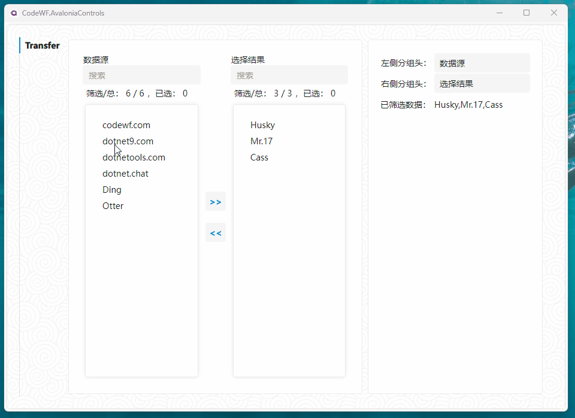
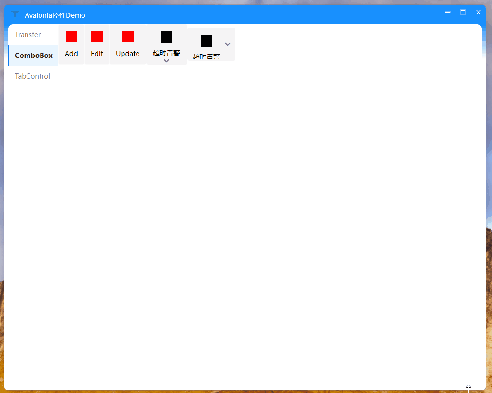
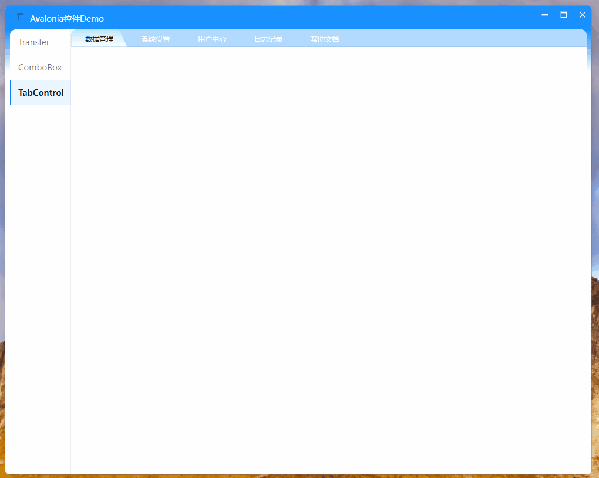

# CodeWF.AvaloniaControls

| Name | NuGet | Download |
|------|-----------|--------|
| CodeWF.AvaloniaControls | [](https://www.nuget.org/packages/CodeWF.AvaloniaControls/) | [](https://www.nuget.org/packages/CodeWF.AvaloniaControls/) |
| CodeWF.AvaloniaControls.DataGrid | [](https://www.nuget.org/packages/CodeWF.AvaloniaControls.DataGrid/) | [](https://www.nuget.org/packages/CodeWF.AvaloniaControls.DataGrid/) |
| CodeWF.AvaloniaControls.Dock | [](https://www.nuget.org/packages/CodeWF.AvaloniaControls.Dock/) | [](https://www.nuget.org/packages/CodeWF.AvaloniaControls.Dock/) |
| CodeWF.Core | [](https://www.nuget.org/packages/CodeWF.Core/) | [](https://www.nuget.org/packages/CodeWF.Core/) |
| CodeWF.Themes | [](https://www.nuget.org/packages/CodeWF.Themes/) | [](https://www.nuget.org/packages/CodeWF.Themes/) |

一个自定义的Avalonia UI控件库

简体中文 | [English](README.MD)

## 安装

```shell
Install-Package CodeWF.AvaloniaControls
```

## 控件Demo

### Transfer



### ComboBox



### TabControl

