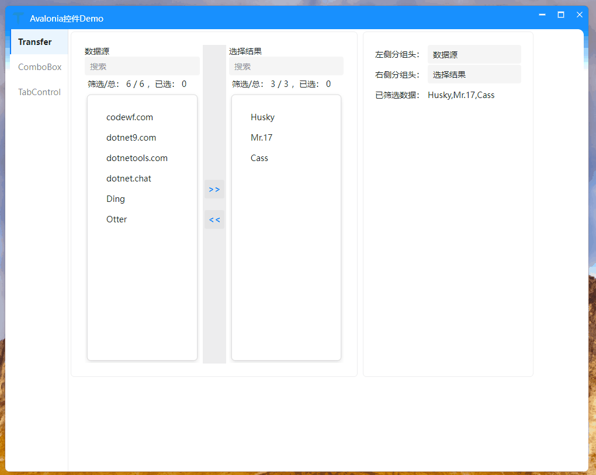
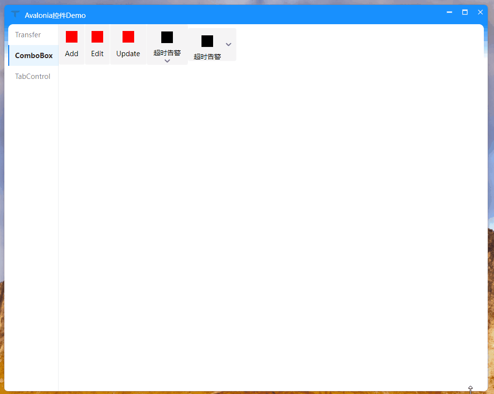
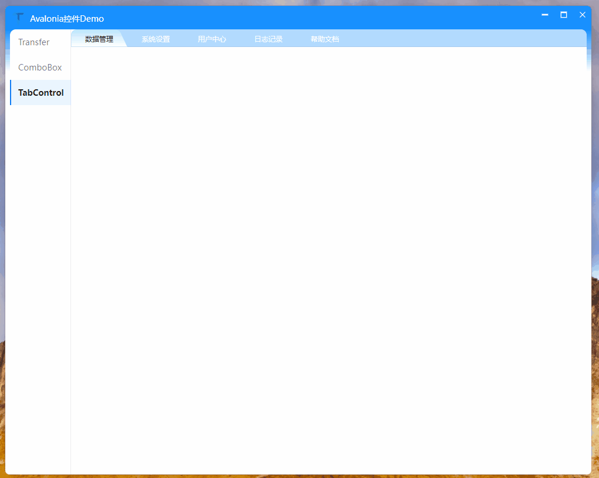

# CodeWF.AvaloniaControls

| Name | NuGet | Download |
|------|-------|----------|
| CodeWF.AvaloniaControls | [](https://www.nuget.org/packages/CodeWF.AvaloniaControls/) | [](https://www.nuget.org/packages/CodeWF.AvaloniaControls/) |
| CodeWF.AvaloniaControls.Themes | [](https://www.nuget.org/packages/CodeWF.AvaloniaControls.Themes/) | [](https://www.nuget.org/packages/CodeWF.AvaloniaControls.Themes/) |

An open-source Avalonia control repository based on .NET 11 and Avalonia 12, including reusable libraries and runnable samples.

English | [简体中文](README.zh-CN.md)

## Install

```shell
Install-Package CodeWF.AvaloniaControls
Install-Package CodeWF.AvaloniaControls.Themes
```

Add the theme package to your Avalonia application styles:

```xml
<Application
    xmlns="https://github.com/avaloniaui"
    xmlns:x="http://schemas.microsoft.com/winfx/2006/xaml"
    xmlns:codewf="https://codewf.com">
    <Application.Styles>
        <codewf:CodeWFTheme />
    </Application.Styles>
</Application>
```

## Repository Layout

- `src/`: all physical project directories, including NuGet libraries and runnable samples
- `docs/`: screenshots, GIF assets, and repository documentation assets
- `artifacts/`: package outputs and temporary build artifacts
- `publish/`: sample application publish outputs generated by the publish scripts
- `CodeWF.AvaloniaControls.slnx`: logical solution view that groups projects by package line and sample purpose

## Package Lines

### Avalonia 12 main line

- `CodeWF.AvaloniaControls`: general-purpose custom control APIs, state models, helpers, and drawing logic
- `CodeWF.AvaloniaControls.Themes`: control templates and visual resources for the main control package

Markdown packages now live in the standalone [CodeWF.Markdown](https://github.com/dotnet9/CodeWF.Markdown) repository.

Legacy free `DataGrid` / `TreeDataGrid` packages and samples now live in the standalone [CodeWF.AvaloniaControls.DataGrid](https://github.com/dotnet9/CodeWF.AvaloniaControls.DataGrid) repository.

Dock packages and samples now live in the standalone [CodeWF.AvaloniaControls.Dock](https://github.com/dotnet9/CodeWF.AvaloniaControls.Dock) repository.

ProDataGrid packages and samples now live in the standalone [CodeWF.AvaloniaControls.ProDataGrid](https://github.com/dotnet9/CodeWF.AvaloniaControls.ProDataGrid) repository.

## Controls

- `Guide`: multi-step onboarding and feature-tour control for desktop applications.
- `Transfer` / `SearchListBox`: dual-list transfer and searchable list controls.
- `StatusBadge` / `StatusCard`: semantic status labels and health summary cards.
- `CodeWFWindow` / `CodeWFTitleBar`: custom window shell and title bar controls.
- TabControl styles, markup helpers, converters, and small drawing helpers.

## Guide Control

`Guide` is built for Avalonia desktop onboarding, feature tours, and contextual hints. It can highlight different controls step by step, render a mask with a transparent target hole, place the guide card around the target, and keep the highlight aligned when layout or window size changes.

Covered scenarios:

- Multi-step navigation with previous, next, finish, and close actions.
- Targeted steps and targetless centered steps.
- Per-step placement, mask visibility, arrow visibility, gap offsets, corner radius, and style type.
- Non-modal hints by setting `IsShowMask="False"`.
- Custom cover content, custom action buttons, and text or dot indicators.
- Delayed target resolution for controls that appear later.
- Targets inside `Menu`, `Popup`, and `Flyout` layers.
- `StepOpening` and opening commands for switching tabs or opening parent menus before a step is resolved.

Basic usage:

```xml
<Grid>
    <StackPanel Orientation="Horizontal" Spacing="10">
        <Button x:Name="UploadButton" Content="Upload file" />
        <Button x:Name="SaveButton" Content="Save changes" />
        <Button x:Name="MoreButton" Content="More actions" />
    </StackPanel>

    <codewf:Guide x:Name="BasicGuide" Placement="Bottom" PopupOffset="14">
        <codewf:GuideStep
            Target="{Binding ElementName=UploadButton}"
            Title="Upload file"
            Description="Add local files to the processing queue." />
        <codewf:GuideStep
            Target="{Binding ElementName=SaveButton}"
            Placement="Right"
            Title="Save changes"
            Description="Persist the current workspace." />
        <codewf:GuideStep
            Target="{Binding ElementName=MoreButton}"
            Placement="Top"
            Title="More actions"
            Description="Continue with export, copy, or batch operations." />
    </codewf:Guide>
</Grid>
```

```csharp
BasicGuide.GoTo(0);
BasicGuide.Show();
```

For dynamic menu steps, open the parent menu before resolving the child target and give the popup layer a short layout delay:

```xml
<codewf:Guide
    x:Name="DynamicGuide"
    TargetResolveDelay="00:00:00.220"
    StepOpening="DynamicGuide_OnStepOpening">
    <codewf:GuideStep
        Target="{Binding ElementName=GuideThemeMenu}"
        Title="Theme menu" />
    <codewf:GuideStep
        Target="{Binding ElementName=GuideThemeBlueItem}"
        Placement="RightBottom"
        Title="Blue theme" />
</codewf:Guide>
```

```csharp
private void DynamicGuide_OnStepOpening(object? sender, GuideStepEventArgs e)
{
    GuideThemeMenu.IsSubMenuOpen = e.Index is >= 1 and <= 3;
    Dispatcher.UIThread.Post(
        () => GuideThemeMenu.IsSubMenuOpen = true,
        DispatcherPriority.Background);
}
```

## Sample Applications

- `CodeWF.AvaloniaControlsDemo`: runnable showcase for Transfer, VComboBox, TabControl, Guide, StatusBadge, StatusCard, custom windows, and AnimatedImage.

## Shared Configuration

- `Directory.Packages.props`: central package management for the Avalonia 12 main line
- `Directory.Build.props`: shared repository/package metadata
- `Directory.Build.targets`: shared pack-time behavior, including common package metadata defaults and root README/CHANGELOG injection for packable libraries
- `Publish.Common.pubxml`: shared publish settings
- `src/*/Properties/PublishProfiles/Publish.Project.pubxml`: per-project publish supplements such as trimmer root descriptors

## Scripts

- `pack.bat`: restore, build, and pack all publishable libraries into `artifacts/packages`
- `publish_all.bat`: publish all sample applications into `publish/`
- `publishbase.bat`: shared publish helper used by the root publish scripts

## Changelogs

- Root repository updates are tracked in `CHANGELOG.md`
- Each project also keeps its own `CHANGELOG.md` under its project directory for package/sample-specific history

## Open Source Notes

- Commercial package lines are intentionally avoided in this repository

## Third-Party Open Source Audit

Checked on 2026-05-20 with NuGet metadata, restored `project.assets.json`, and upstream source/license links. MIT / Apache-2.0 / BSD are preferred.

Remediation:

- Replaced `Semi.Avalonia.AvaloniaEdit` with the open-source `Avalonia.AvaloniaEdit` package.
- Removed `AvaloniaUI.DiagnosticsSupport` because the NuGet package does not publish a clear open-source license or source repository.

| Package | License | Source | Status |
| --- | --- | --- | --- |
| `Avalonia` / `Avalonia.Desktop` / `Avalonia.Fonts.Inter` / `Avalonia.Themes.Fluent` | MIT | https://github.com/AvaloniaUI/Avalonia | Approved |
| `Avalonia.AvaloniaEdit` | MIT | https://github.com/AvaloniaUI/AvaloniaEdit | Approved |
| `AnimatedImage.Avalonia` | Apache-2.0 | https://github.com/whistyun/AnimatedImage | Approved |
| `CodeWF.LogViewer.Avalonia` | MIT | https://github.com/dotnet9/CodeWF.LogViewer | Own open-source package |
| `CommunityToolkit.Mvvm` | MIT | https://github.com/CommunityToolkit/dotnet | Approved |
| `Irihi.Ursa.Themes.Semi` | MIT | https://github.com/irihitech/Ursa.Avalonia | Approved |
| `Lang.Avalonia.Json` | MIT | https://github.com/dotnet9/Lang.Avalonia | Approved |
| `ReactiveUI.Avalonia` | MIT | https://github.com/reactiveui/reactiveui | Approved |
| `Semi.Avalonia` | MIT | https://github.com/irihitech/Semi.Avalonia | Approved, only the open core package is used |
| `VC-LTL` | EPL-2.0 | https://github.com/Chuyu-Team/VC-LTL5 | Source-open; approved under the source-traceable non-preferred license rule |
| `YY-Thunks` | MIT | https://github.com/Chuyu-Team/YY-Thunks | Approved |

Transitive dependencies from Avalonia/SkiaSharp/ANGLE were checked and are source-open under MIT or BSD-style licenses. No `Semi.Avalonia.AvaloniaEdit`, `Semi.Avalonia.Dock`, `Semi.Avalonia.ProDataGrid`, or `AvaloniaUI.DiagnosticsSupport` dependency remains in active project files.

## Demo

### Guide


### Transfer



### ComboBox



### TabControl


