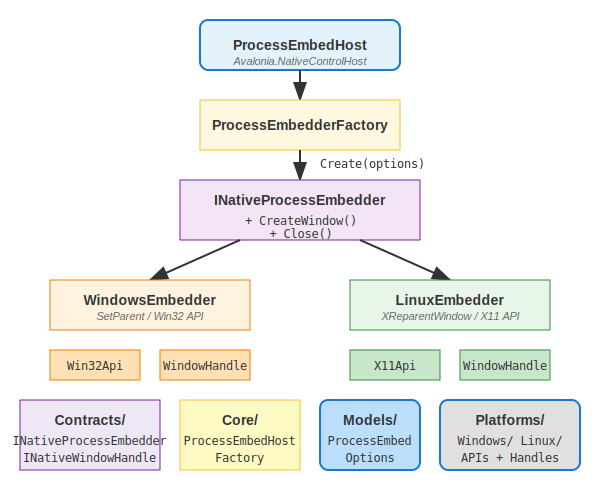

# EmbedProcessWindows 模块设计文档

## 概述

`EmbedProcessWindows` 模块用于将外部进程的主窗口嵌入到当前 Avalonia 应用程序中，实现类似 VS Code 嵌入网页的"工具窗口"效果。

## 架构设计

### 设计模式

采用**策略模式（Strategy Pattern）** 结合 **工厂模式（Factory Pattern）**：



### 核心接口

#### INativeProcessEmbedder

定义进程嵌入器的标准行为：

```csharp
public interface INativeProcessEmbedder
{
    IPlatformHandle CreateWindow(IPlatformHandle parent, Func<IPlatformHandle> createDefault);
    void Close();
    IntPtr ProcessWindowHandle { get; }
}
```

#### INativeWindowHandle

封装平台窗口句柄：

```csharp
public interface INativeWindowHandle : IPlatformHandle, INativeControlHostDestroyableControlHandle
{
    new IntPtr Handle { get; }
    new string? Descriptor { get; }
    new void Destroy();
}
```

## 目录结构

```
EmbedProcessWindows/
├── Contracts/                    # 接口定义
│   ├── INativeProcessEmbedder.cs # 嵌入器核心接口
│   └── INativeWindowHandle.cs    # 窗口句柄接口
├── Core/                         # 核心实现
│   ├── ProcessEmbedHost.cs        # Avalonia 控件宿主
│   └── ProcessEmbedderFactory.cs  # 工厂类
├── Models/                       # 数据模型
│   └── ProcessEmbedOptions.cs    # 配置选项
└── Platforms/                    # 平台实现
    ├── Linux/
    │   ├── LinuxEmbedder.cs       # X11 窗口嵌入
    │   ├── LinuxWindowHandle.cs   # Linux 句柄
    │   └── X11Api.cs              # X11 P/Invoke
    └── Windows/
        ├── WindowsEmbedder.cs      # Win32 窗口嵌入
        ├── WindowsWindowHandle.cs  # Windows 句柄
        └── Win32Api.cs             # Win32 P/Invoke
```

## 类说明

### Contracts

#### INativeProcessEmbedder
定义所有平台嵌入器必须实现的方法：
- `CreateWindow` - 创建并嵌入第三方进程窗口
- `Close` - 关闭已嵌入的进程
- `ProcessWindowHandle` - 获取进程窗口句柄

#### INativeWindowHandle
封装原生窗口句柄，提供统一的接口访问底层平台句柄。

### Core

#### ProcessEmbedHost
继承自 `Avalonia.Controls.NativeControlHost`，是嵌入窗口的容器控件。

**主要职责**：
- 持有 `INativeProcessEmbedder` 实例
- 在 `CreateNativeControlCore` 中调用嵌入器创建窗口
- 提供 `CloseAll()` 静态方法关闭所有已创建的嵌入窗口

**平台特定行为**：
- **Linux**：在 `OnLoaded` 生命周期中，通过短暂调整主窗口宽度（+1/-1）触发 X11 窗口布局刷新，解决子进程窗口初始尺寸不正确的问题

**使用方式**：
```csharp
var embedHost = new ProcessEmbedHost("path/to/app.exe", workDir, args);
contentControl.Content = embedHost;
```

#### ProcessEmbedderFactory
根据运行时平台自动创建对应的嵌入器：

```csharp
var embedder = ProcessEmbedderFactory.Create(options);
// 内部自动判断：
// - Windows → WindowsEmbedder
// - Linux   → LinuxEmbedder
```

### Models

#### ProcessEmbedOptions
进程嵌入配置，包含：
- `ProcessPath` - 可执行文件路径
- `WorkingDirectory` - 工作目录
- `Arguments` - 命令行参数
- `WindowReadyTimeoutMs` - 等待窗口就绪超时（默认 5000ms）
- `WindowSearchDelayMs` - 查找窗口重试间隔（默认 50ms）
- `WindowSearchTimeoutMs` - 查找窗口总超时时间（默认 30000ms）

### Platforms

#### WindowsEmbedder
Windows 平台实现，使用 Win32 API：
1. 启动进程
2. 等待窗口就绪（`WaitForInputIdle`）
3. 获取主窗口句柄
4. 修改窗口样式（移除边框、最大化等按钮）
5. 调用 `SetParent` 设置父窗口

#### LinuxEmbedder
Linux 平台实现，使用 X11 API：
1. 打开 X11 显示
2. 启动进程
3. 通过 PID 遍历窗口树查找窗口
4. 修改窗口属性（`override_redirect`）
5. 取消映射 → 重父化 → 重新映射
6. 调整窗口大小匹配父容器

#### WindowsWindowHandle / LinuxWindowHandle
平台特定的窗口句柄实现，继承 `PlatformHandle` 并实现 `INativeControlHostDestroyableControlHandle`。

### Platforms/Linux/X11Api.cs
X11 API 的 P/Invoke 声明，包括：
- `XOpenDisplay` / `XCloseDisplay`
- `XReparentWindow`
- `XUnmapWindow` / `XMapWindow`
- `XMoveWindow` / `XResizeWindow`
- `XFlush` / `XSync`
- `XGetGeometry`
- `XQueryTree` / `XGetWindowProperty`
- `XInternAtom`
- `XDestroyWindow`

### Platforms/Windows/Win32Api.cs
Win32 API 的 P/Invoke 声明，包括：
- `SetParent`
- `SetWindowLongPtr` / `GetWindowLongPtr`
- `SetWindowPos`
- `DestroyWindow`
- 窗口样式常量（`WS_CHILD`, `GWL_STYLE` 等）

## 平台实现差异

| 特性 | Windows | Linux |
|------|---------|-------|
| 窗口嵌入 | `SetParent` | `XReparentWindow` |
| 窗口查找 | `Process.MainWindowHandle` | 遍历 X11 窗口树 |
| 样式修改 | `SetWindowLongPtr` | `XChangeWindowAttributes` |
| 大小调整 | `SetWindowPos` | `XResizeWindow` |

## Linux X11 嵌入流程

```
1. XOpenDisplay          打开 X11 连接
2. StartProcess         启动子进程
3. FindWindowByPID      通过 PID 找到窗口
4. ModifyWindowAttributes 设置 override_redirect
5. XUnmapWindow         取消映射窗口
6. XReparentWindow       重父化到目标容器
7. XMapWindow           重新映射窗口
8. ResizeWindowToParent 调整大小铺满容器
9. XFlush               刷新请求
```

## 注意事项

### 跨平台兼容性
- Windows 使用 `SetParent` 直接嵌入
- Linux 使用 X11 的 `XReparentWindow`，但需要处理窗口管理器干预

### 进程生命周期
- 嵌入窗口关闭时，进程可能仍在运行
- `CloseAll()` 会向进程发送关闭消息或强制终止

### 错误处理
- 找不到窗口、超时等情况会记录日志并返回默认句柄
- 异常不会传播到上层，保证 UI 稳定性

### 性能考虑
- `WindowSearchDelayMs` 影响启动速度，可根据目标进程调整
- Linux 下窗口查找会重试多次，建议设置合适的延迟
